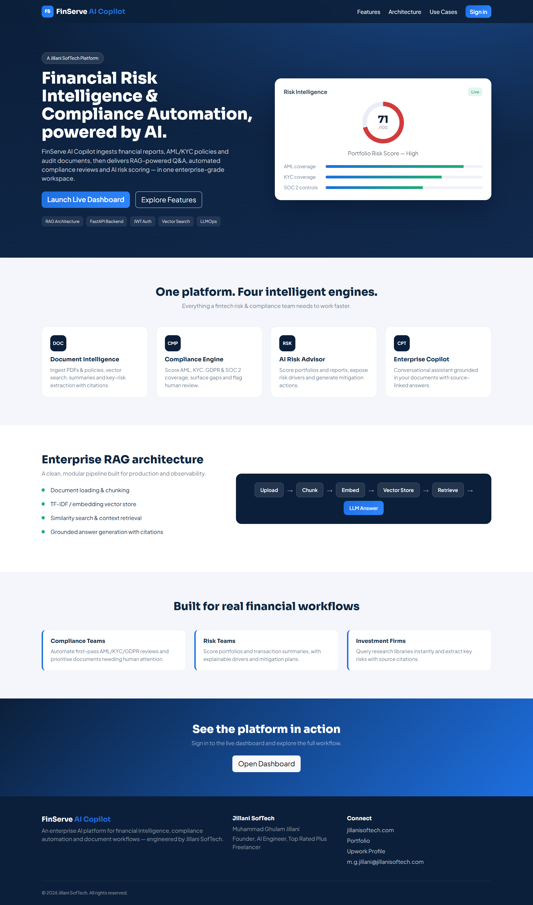
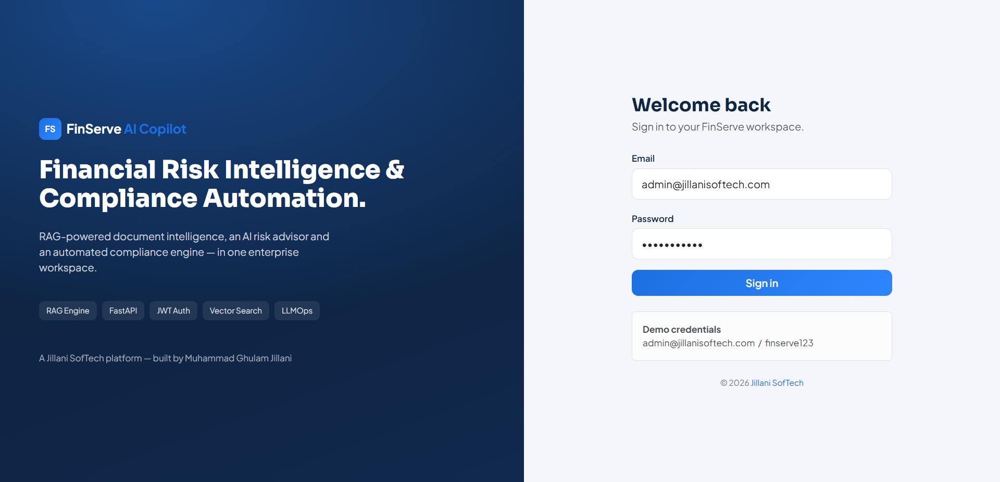
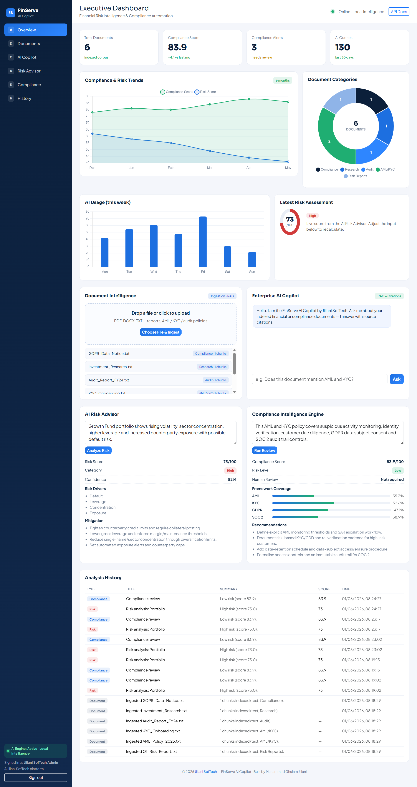

<div align="center">


# 🏦 FinServe AI Copilot

### Enterprise Financial Risk Intelligence, Compliance Automation & Document Intelligence Platform

[](https://python.org)
[](https://fastapi.tiangolo.com)
[](#-how-the-rag-pipeline-works)
[](https://openai.com)
[](#-security)
[](https://sqlite.org)
[](https://getbootstrap.com)
[](https://chartjs.org)
[](https://docker.com)

**Built by [Jillani SofTech](https://www.jillanisoftech.com/) · Enterprise AI Engineering**

[🚀 Quick Start](#-quick-start) · [✨ Features](#-features) · [🏗️ Architecture](#-architecture) · [📡 API](#-api-reference) · [🐳 Docker](#-docker-deployment)

---



</div>

---

## 📌 What Is This?

**FinServe AI Copilot** is a full-stack, production-inspired AI platform that ingests financial reports, AML/KYC policies, audit documents and investment research - then lets you **chat with them**, **score portfolio risk**, **run automated compliance reviews**, and **track every analysis** with source-level citations.

It pairs a **Retrieval-Augmented Generation (RAG)** pipeline with an **AI Risk Advisor** and a **Compliance Intelligence Engine**, all behind a **secure FastAPI backend** and a **premium SaaS dashboard**.

> ⚠️ **Not a toy demo.** JWT authentication, real TF-IDF + cosine vector retrieval, SQLite persistence, PDF/DOCX ingestion, dual-mode AI (OpenAI **or** an offline Local Intelligence engine), Docker deployment, and a custom Bootstrap + Chart.js frontend - no Streamlit, no Next.js.

---

## ✨ Features

| Feature | Description |
|---|---|
| 📄 **Document Intelligence** | Ingest PDF / DOCX / TXT, chunk with overlap, vectorise and index for semantic retrieval |
| 🔍 **Hybrid-Ready Retrieval** | TF-IDF + cosine similarity ranking, embeddings-ready (OpenAI `text-embedding-3-small`) |
| 🤖 **Enterprise AI Copilot** | Conversational, document-grounded Q&A with per-answer source citations and confidence |
| 📊 **AI Risk Advisor** | Weighted-severity risk scoring with explainable drivers, mitigation actions and confidence |
| 📋 **Compliance Engine** | Per-framework AML / KYC / GDPR / SOC 2 coverage %, status, gaps and human-review flags |
| 🔐 **JWT Authentication** | HS256 tokens + PBKDF2-HMAC-SHA256 password hashing, protected API endpoints |
| 🗄️ **Full Persistence** | SQLite stores users, documents, chunks and complete analysis history |
| 📈 **Executive Dashboard** | KPI cards, compliance/risk trends, document-category doughnut, AI-usage and live risk ring |
| 🧠 **Dual-Mode AI** | **LLM mode** (OpenAI) with automatic offline **Local Intelligence** fallback |
| 🐳 **Docker Ready** | Single `docker compose up` spins up the full platform |

---

## 🖼️ Screenshots

<div align="center">

### Landing Page


### Secure Login


### Executive Dashboard


</div>

---

## 🏗️ Architecture

```
┌──────────────────────────────────────────────────────────────────┐
│                      CLIENT  (SPA Frontend)                      │
│      HTML5 · CSS3 · Vanilla JS · Bootstrap 5 · Chart.js          │
│            index.html · login.html · dashboard.html              │
└─────────────────────────┬────────────────────────────────────────┘
                          │  JWT bearer token · fetch() REST
┌─────────────────────────▼────────────────────────────────────────┐
│                  FastAPI  Backend  (Port 8000)                   │
│   /auth  /health  /documents  /rag  /risk  /compliance           │
│   /analysis/history   /dashboard/metrics   /dashboard/charts     │
└──────┬───────────────────┬─────────────────────┬─────────────────┘
       │                   │                     │
┌──────▼──────┐   ┌────────▼────────┐    ┌───────▼────────┐
│  Ingestion  │   │   AI Engine     │    │   SQLite DB    │
│  Pipeline   │   │                 │    │                │
│             │   │  LLM mode       │    │  users         │
│  Loader     │   │   (OpenAI)      │    │  documents     │
│  Chunker    │   │   ── or ──      │    │  chunks        │
│  Vectoriser │   │  Local          │    │  history       │
│  Index      │   │  Intelligence   │    └────────────────┘
└──────┬──────┘   └────────┬────────┘
       │                   │
┌──────▼───────────────────▼────────┐
│         Retrieval Pipeline        │
│                                   │
│  1. Tokenise + remove stopwords   │
│  2. TF-IDF vectorisation          │
│  3. Cosine similarity  →  top-k   │
│  4. Sentence ranking + citations  │
│  5. Grounded answer (LLM / Local) │
└───────────────────────────────────┘
```

### Request Flow

```
[User]
   │  login (email + password)
   ▼
/auth/login ──► JWT issued (HS256, 12h) ──► stored client-side
   │
   ▼
[Dashboard]  every API call carries  Authorization: Bearer <token>
   │
   ├──► /documents/upload  ──►  ingest ──► chunk ──► vector index ──► SQLite
   ├──► /rag/query         ──►  retrieve top-k ──► grounded answer + citations
   ├──► /risk/analyze      ──►  weighted scoring ──► drivers + mitigation
   ├──► /compliance/review ──►  framework coverage ──► gaps + recommendations
   └──► /dashboard/metrics ──►  live KPIs + chart datasets
```

---

## 🗂️ Project Structure

```
finserve-ai-copilot/
├── backend/
│   ├── main.py                       # FastAPI app, routers, StaticFiles, lifespan
│   ├── config.py                     # Settings (env-driven)
│   ├── models.py                     # Pydantic v2 request/response schemas
│   ├── security.py                   # JWT (HS256) + PBKDF2 password hashing
│   ├── database.py                   # SQLite layer (users, docs, chunks, history)
│   ├── seed.py                       # Demo user + sample corpus seeding
│   ├── routers/
│   │   ├── auth.py                   # POST /auth/login
│   │   ├── health.py                 # GET  /health
│   │   ├── documents.py              # Upload / list documents
│   │   ├── rag.py                    # POST /rag/query
│   │   ├── risk.py                   # POST /risk/analyze
│   │   ├── compliance.py             # POST /compliance/review
│   │   ├── analysis.py               # GET  /analysis/history
│   │   ├── dashboard.py              # Metrics + chart datasets
│   │   └── deps.py                   # Auth dependency (bearer guard)
│   ├── services/
│   │   ├── vector_store.py           # TF-IDF + cosine retrieval (embeddings-ready)
│   │   ├── document_loader.py        # PDF / DOCX / TXT extraction
│   │   ├── ai_engine.py              # Dual-mode AI (OpenAI / Local Intelligence)
│   │   ├── rag_service.py            # Ingestion + RAG orchestration
│   │   ├── risk_service.py           # Risk scoring + history
│   │   └── compliance_service.py     # Compliance review + history
│   └── utils/
│       └── logger.py                 # Structured logging
├── frontend/
│   ├── index.html                    # Landing page
│   ├── login.html                    # JWT login
│   ├── dashboard.html                # Executive dashboard
│   └── assets/
│       ├── css/   (style.css, dashboard.css)
│       ├── js/    (api.js, auth.js, charts.js, dashboard.js)
│       ├── components/ (navbar, sidebar, footer)
│       └── images/
├── docs/ARCHITECTURE.md
├── sample_data/   (AML / KYC / risk sample policies)
├── screenshots/   (Main_Page_UI.png, Login_Page_UI.png, Dashboard_Page_UI.png)
├── requirements.txt
├── run.py
├── Dockerfile
├── docker-compose.yml
└── .env.example
```

---

## ⚙️ Tech Stack

| Layer | Technology |
|---|---|
| **LLM** | OpenAI GPT-4o / GPT-4o-mini (optional) |
| **Embeddings** | OpenAI `text-embedding-3-large` (optional) |
| **Retrieval** | TF-IDF + cosine similarity (dependency-free), embeddings-ready |
| **AI Fallback** | Local Intelligence engine (weighted lexicons, fully offline) |
| **Backend** | FastAPI + Uvicorn |
| **Validation** | Pydantic v2 |
| **Auth** | JWT HS256 + PBKDF2-HMAC-SHA256 (standard library) |
| **Database** | SQLite (users, documents, chunks, history) |
| **Document Parsing** | PyMuPDF / pypdf + python-docx (optional) |
| **Frontend** | HTML5 · CSS3 · Vanilla JS · Bootstrap 5 · Chart.js |
| **Deployment** | Docker + Docker Compose |

---

## 🚀 Quick Start

### Prerequisites
- Python 3.12+
- (Optional) OpenAI API key for real LLM mode
- (Optional) Docker + Docker Compose

### Option A - Local Development

```bash
# 1. Clone
git clone https://github.com/jillanisoftech/finserve-ai-copilot.git
cd finserve-ai-copilot

# 2. Virtual environment
python -m venv .venv
source .venv/bin/activate            # Windows: .venv\Scripts\activate

# 3. Install dependencies
pip install -r requirements.txt

# 4. (Optional) configure environment
cp .env.example .env                 # works out-of-the-box without editing

# 5. Run
python run.py
```

Open in your browser (use **localhost**, not 0.0.0.0):

| Page | URL |
|---|---|
| 🔐 Login | `http://localhost:8000/login` |
| 🏠 Landing | `http://localhost:8000` |
| 📊 Dashboard | `http://localhost:8000/dashboard` |
| 📡 API Docs | `http://localhost:8000/docs` |

**Demo credentials:** `admin@jillanisoftech.com` / `finserve123`

### Option B - Docker

```bash
docker compose up --build
# App: http://localhost:8000   ·   API docs: http://localhost:8000/docs
```

---

## 🔑 Environment Variables

Copy `.env.example` to `.env`. **All values are optional** - the platform runs fully offline by default.

```env
# Real LLM mode (leave blank to use the offline Local Intelligence engine)
OPENAI_API_KEY=
MODEL_NAME=gpt-4o-mini
EMBEDDING_MODEL=text-embedding-3-small

# Security
SECRET_KEY=change-me-in-production
TOKEN_EXPIRE_MINUTES=720
DEMO_EMAIL=admin@jillanisoftech.com
DEMO_PASSWORD=finserve123

# Persistence & server
DB_PATH=finserve.db
HOST=0.0.0.0
PORT=8000
```

---

## 📡 API Reference

| Method | Endpoint | Auth | Description |
|---|---|---|---|
| `POST` | `/auth/login` | - | Obtain a JWT access token |
| `GET` | `/health` | - | Service status + active AI mode |
| `POST` | `/documents/upload` | ✓ | Upload a document - triggers ingestion + indexing |
| `GET` | `/documents` | ✓ | List all indexed documents |
| `POST` | `/rag/query` | ✓ | Ask a question - returns grounded answer + citations |
| `POST` | `/risk/analyze` | ✓ | Score a portfolio / risk summary |
| `POST` | `/compliance/review` | ✓ | Run a framework compliance review |
| `GET` | `/analysis/history` | ✓ | Retrieve analysis history |
| `GET` | `/dashboard/metrics` | ✓ | KPI metrics |
| `GET` | `/dashboard/charts` | ✓ | Chart datasets |

### Example: RAG Query

```json
POST /rag/query
{
  "query": "Does this document mention AML and KYC due diligence?",
  "top_k": 4
}
```

```json
{
  "query": "Does this document mention AML and KYC due diligence?",
  "answer": "The AML policy defines suspicious activity monitoring and SAR filing aligned with FATF. KYC onboarding requires identity verification and customer due diligence...",
  "citations": [
    { "filename": "AML_Policy_2025.txt", "snippet": "...customer due diligence...", "score": 0.41 }
  ],
  "confidence": 0.75,
  "model": "finserve-local-intelligence-v2",
  "mode": "local"
}
```

---

## 🧠 How the RAG Pipeline Works

1. **Upload** - A PDF/DOCX/TXT is extracted (PyMuPDF/pypdf/python-docx), split into ~110-word chunks with 25-word overlap, and stored in SQLite.
2. **Vectorise** - Each chunk is tokenised (stopwords removed) and represented as a TF-IDF vector. When `OPENAI_API_KEY` is set, dense embeddings can be plugged in.
3. **Retrieve** - An incoming query is vectorised and scored against every chunk with **cosine similarity**; the top-k passages are returned.
4. **Rank & Cite** - The most relevant sentences are extracted and each source is attached as a citation with a relevance score.
5. **Answer** - `ai_engine` generates a grounded answer using **GPT-4o (LLM mode)** or the **Local Intelligence engine (offline)**. The active mode is reported at `/health`.

---

## 🔐 Security

- **JWT (HS256)** stateless access tokens signed with `SECRET_KEY`, 12-hour expiry by default.
- **PBKDF2-HMAC-SHA256** password hashing with a per-user salt (120k iterations).
- **Protected endpoints** - every data route requires a valid `Authorization: Bearer <token>`.
- Implemented with the Python standard library - no extra crypto dependencies.

---

## 🗄️ Database Schema

```sql
CREATE TABLE users (
  id INTEGER PRIMARY KEY AUTOINCREMENT,
  email TEXT UNIQUE NOT NULL,
  name TEXT,
  role TEXT DEFAULT 'admin',
  password_hash TEXT NOT NULL,
  created_at TEXT
);

CREATE TABLE documents (
  id TEXT PRIMARY KEY,
  filename TEXT NOT NULL,
  category TEXT,
  size_bytes INTEGER,
  chunks INTEGER,
  summary TEXT,
  uploaded_at TEXT
);

CREATE TABLE chunks (
  id INTEGER PRIMARY KEY AUTOINCREMENT,
  document_id TEXT,
  filename TEXT,
  ordinal INTEGER,
  text TEXT
);

CREATE TABLE history (
  id TEXT PRIMARY KEY,
  type TEXT,            -- document | rag | risk | compliance
  title TEXT,
  summary TEXT,
  score REAL,
  payload TEXT,         -- JSON
  created_at TEXT
);
```

---

## 🗺️ Roadmap

- 🔌 Managed vector DB (ChromaDB / FAISS / Pinecone) with dense embeddings
- 👥 Multi-tenant workspaces + role-based access control (RBAC)
- 📑 Structured PDF risk-report export
- 🤝 Agentic multi-step workflows (LangGraph)
- ⚙️ Async batch ingestion + background jobs
- 📊 Audit-log export for compliance teams

---

## 🤝 About Jillani SofTech

<div align="center">

**[Jillani SofTech](https://www.jillanisoftech.com/)** helps startups, agencies and enterprises build **production-ready AI systems** - RAG platforms, AI agents, LLM SaaS products, workflow automation, full-stack AI applications, production ML systems, MLOps and LLMOps.

We work with clients across the **USA, UK, Germany, EU and the Gulf region**, turning AI ideas into scalable business systems that run reliably on real data.

</div>

### 👨‍💻 Founder - Muhammad Ghulam Jillani
**Full Stack AI Engineer · Lead AI Data Scientist · Founder of Jillani SofTech**

- 🏆 **Top Rated Plus** on Upwork
- 💰 **$100K+ earned** delivering client AI systems
- 🚀 **22 production systems** shipped
- 🎙️ **24x LinkedIn Top Voice in AI**

### 🧩 What We Build
- 🤖 Agentic AI Systems (LangGraph, CrewAI, AutoGen)
- 🔍 RAG & Enterprise Knowledge Pipelines
- 🏗️ AI-powered SaaS Products & Full-Stack AI Apps
- ⚙️ LLM Fine-tuning, Deployment, MLOps & LLMOps
- 🔁 Intelligent Workflow & Document Automation

### 📬 Connect
| | |
|---|---|
| 📞 **Book a 1:1 Call** | https://lnkd.in/emns3fF8 |
| 🌐 **Website** | [jillanisoftech.com](https://www.jillanisoftech.com/) |
| 💼 **Upwork** | [Top Rated Plus Profile](https://www.upwork.com/freelancers/~0146d8e0947a992eee) |
| 🔗 **Portfolio** | [mgjillanimughal.github.io](https://mgjillanimughal.github.io/) |
| 📧 **Email** | [m.g.jillani@jillanisoftech.com](mailto:m.g.jillani@jillanisoftech.com) |

> 💡 **If your AI agent fails with real data, DM me your use case - I'll tell you what's missing.**

---

## 📄 License

Proprietary software developed by **Jillani SofTech**. All rights reserved. Distribution, deployment and customization are governed by the client engagement agreement.

---

<div align="center">

**Built with ❤️ by [Muhammad Ghulam Jillani](https://mgjillanimughal.github.io/) · [Jillani SofTech](https://www.jillanisoftech.com/)**

⭐ If this project helped you, please give it a star - it means the world!

</div>